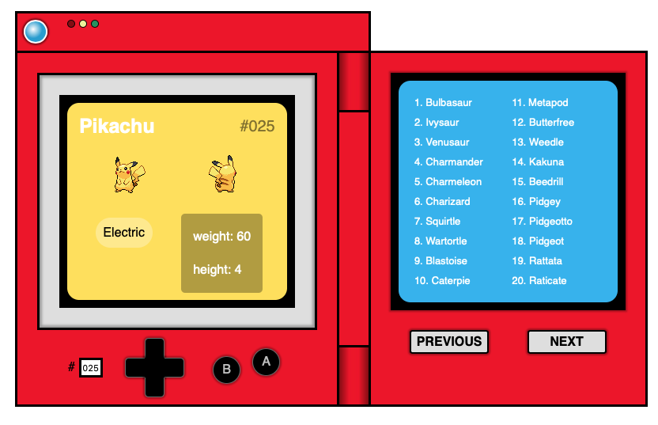
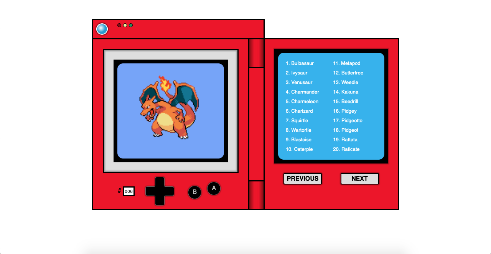

# [Pokédex](https://ptp28.github.io/pokedex/)

This is just a practice project to learn how to use the Javascript fetch() function and to use the PokéAPI to build a replica of the Pokédex.

## Screenshots

## References
* [PokéAPI v2](https://pokeapi.co)
* [PokéAPI documentation](https://pokeapi.co/docs/v2.html/)
* [Justin Kim's tutorial on Youtube](https://www.youtube.com/watch?v=wXjSaZb67n8)
